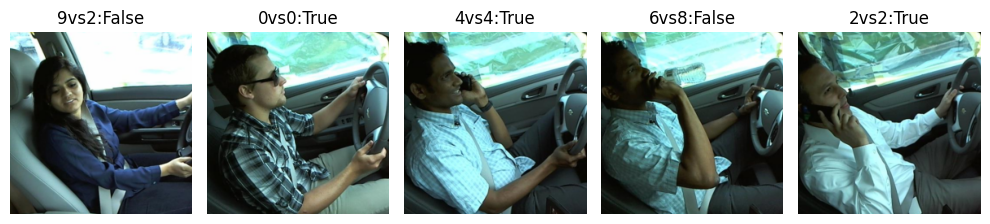
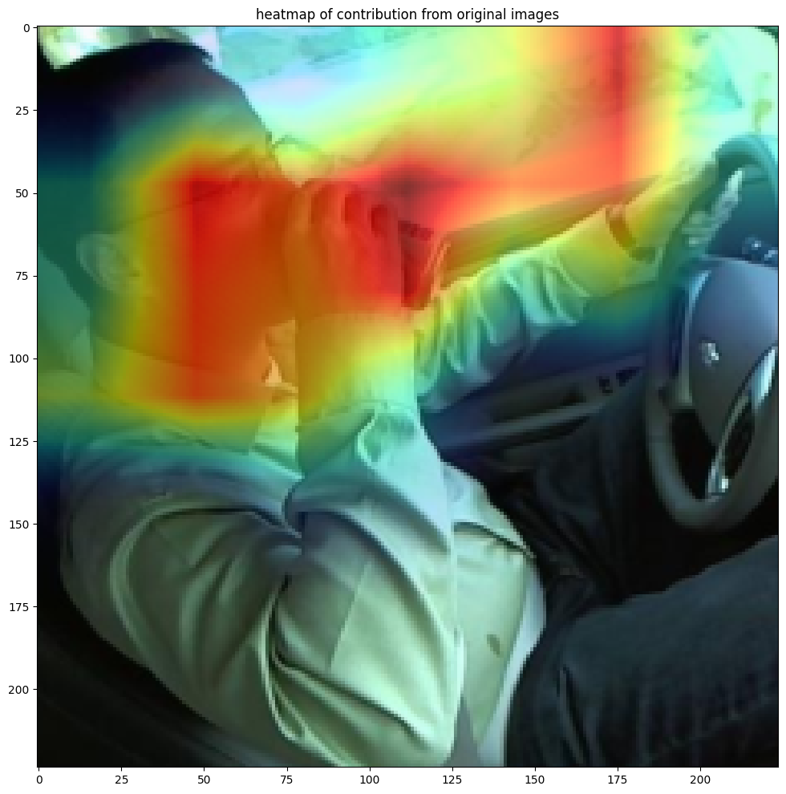

# AML_Classifying_distracted_drivers
## Mandatory assignment for Advanced Machine Learning, ITU Spring 2024

***

## A Project by:
+ Chrisanna K Cornish ccor@itu.dk
+ Christian M Hansen chmh@itu.dk

***

## Data:
The data can be downloaded from [Kaggle](https://www.kaggle.com/c/state-farm-distracted-driver-detection)

Approx 20000 still images from 26 individuals tagged with classes 0-9:
> + c0: normal driving
> + c1: texting - right
> + c2: talking on the phone - right
> + c3: texting - left
> + c4: talking on the phone - left
> + c5: operating the radio
> + c6: drinking
> + c7: reaching behind
> + c8: hair and makeup
> + c9: talking to passenger

Classes are approxiamtely balanced.

According to Kaggle 'State Farm set up these experiments in a controlled environment - a truck dragging the car around on the streets - so these "drivers" weren't really driving.'

## Central Problem
Image classification using tranfer learning and salience consideration

## Models
+ VGG16 [link to trained model](https://drive.google.com/file/d/1_q5qGaAeMFJ5hFZyYPob4_eug0qgYyXh/view?usp=drive_link)
+ ResNet18
+ ResNet50

##


### Plan:
- 1. Fine tune a model for binary classification, distracted or not
- 2. Fine tune a model for multiclass classification, according to provided classes.



- We then want to look at what areas the model is focussing on and create some heatmaps to demonstrate this:



***

### Requirements:
[Requirements.txt](https://github.com/Xannadoo/AML_Classifying_distracted_drivers/blob/main/requirements.txt)

### Folder structure:
```

    statefarm_drivers_01.ipynb
    statefarm_drivers_02.ipynb
    statefarm_drivers_02_vgg.ipynb    
    driver_imgs_list.csv
    model
    ├───resnet50_multi_unfreeze_tune_v02.pt
    src
    ├───imgs
    │   ├───test
    │   └───train
    │       ├───c0
    │       ├───c1
    │       ├───c2
    │       ├───c3
    │       ├───c4
    │       ├───c5
    │       ├───c6
    │       ├───c7
    │       ├───c8
    │       └───c9
    ├───train
    │   ├───c0
    │   └───c1
    ├───train_m
    │   ├───c0
    │   ├───c1
    │   ├───c2
    │   ├───c3
    │   ├───c4
    │   ├───c5
    │   ├───c6
    │   ├───c7
    │   ├───c8
    │   └───c9
    ├───val
    │   ├───c0
    │   └───c1
    └───val_m
        ├───c0
        ├───c1
        ├───c2
        ├───c3
        ├───c4
        ├───c5
        ├───c6
        ├───c7
        ├───c8
        └───c9
 ```
***

